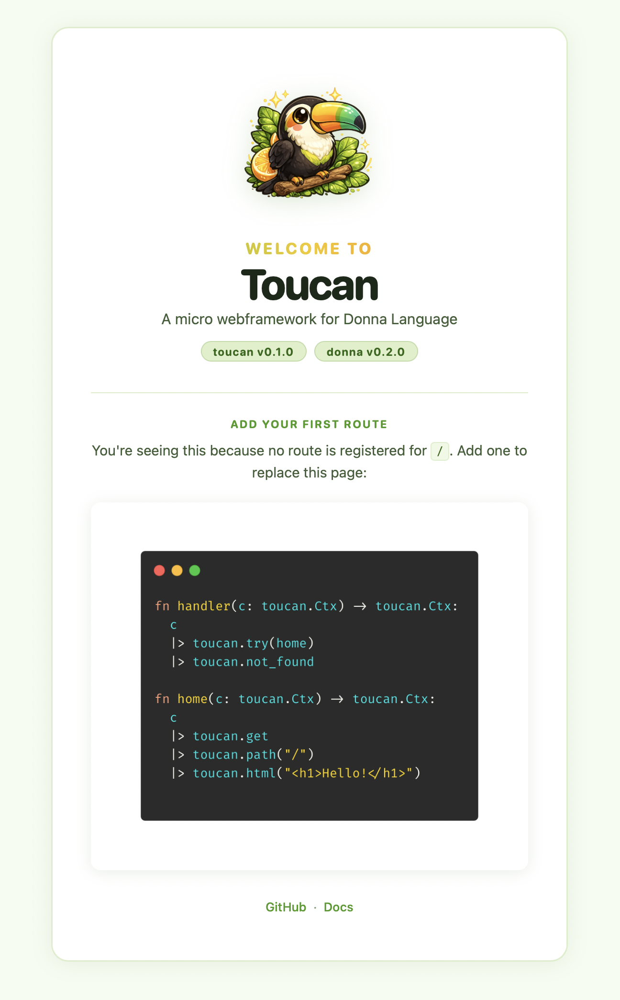

# toucan

<p align="center">
  
</p>

 

Toucan is a micro webframework for [Donna](https://donna-lang.org). Routes are function chains — pipe a request through method filters, path matchers, and response functions using Donna's `|>` operator. Handlers are plain `fn(Ctx) -> Ctx` functions: no macros, no magic, no hidden wiring.

WebSockets are first-class. `serve_chat` adds real-time messaging to any app in a single call, and `serve_with_chat` lets the same app keep shared state such as sessions.


## Install

You need [Donna](https://donna-lang.org/docs/installation/) installed. Create a new app:

```sh
donna new <app>
```

Add toucan to your `donna.toml`:

```toml
toucan = { git = "https://github.com/NikolasSkyl/toucan", version = ">=0.1.0 and <1.0.0" }
```


## Quick Start

```donna
import toucan

fn handler(c: toucan.Ctx) -> toucan.Ctx:
  c
  |> toucan.try(home)
  |> toucan.landing_page
  |> toucan.not_found

fn home(c: toucan.Ctx) -> toucan.Ctx:
  c
  |> toucan.get
  |> toucan.path("/hello")
  |> toucan.html("<h1>Hello from Toucan!</h1>")


pub fn main() -> Nil:
  toucan.serve(handler, 8080)
```

Run it:

```sh
donna run
```

<p align="center">
  
</p>


## Features

- **Pipeline routing** — compose routes with `|>`, each step is a plain function
- **URL parameters** — `:name` captures via `toucan.param(c, "name")`
- **Forms & query strings** — `form_field` and `query_param` built in
- **WebSockets** — `serve_ws` for echo servers, `serve_chat` for broadcast
- **Sessions** — cookie-backed session helpers under `toucan/session`
- **Static files** — serve a directory with `static_dir`
- **CORS & security headers** — one-call `cors`, `csp`, `secure_headers`
- **Request logger** — coloured output with `serve_logged`
- **Redirects & custom status** — `redirect`, `respond`


## Documentation

Full documentation at [nikolasskyl.github.io/toucan](https://nikolasskyl.github.io/toucan).


## Examples

Runnable examples live in `examples/`:

- `basic` — routing and forms
- `todo_sqlite` — server-rendered todos with SQLite and Mustache
- `todo_json_api` — JSON API with SQLite storage
- `auth_login` — registration, login, sessions, and protected pages
- `file_upload` — text and image uploads
- `url_shortener` — short links and redirects
- `htmx_todos` — partial HTML updates with htmx
- `chat_sessions` — WebSocket chat with named users

Each example runs on port `8000`:

```sh
cd examples/basic
donna run
```


## Licence

MIT
